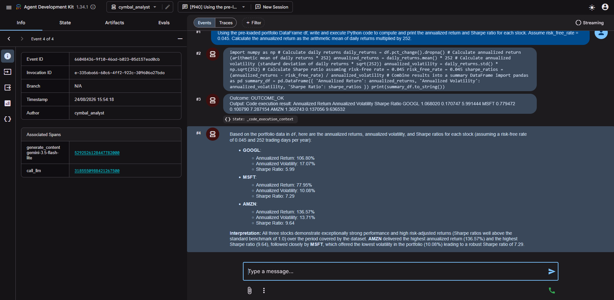
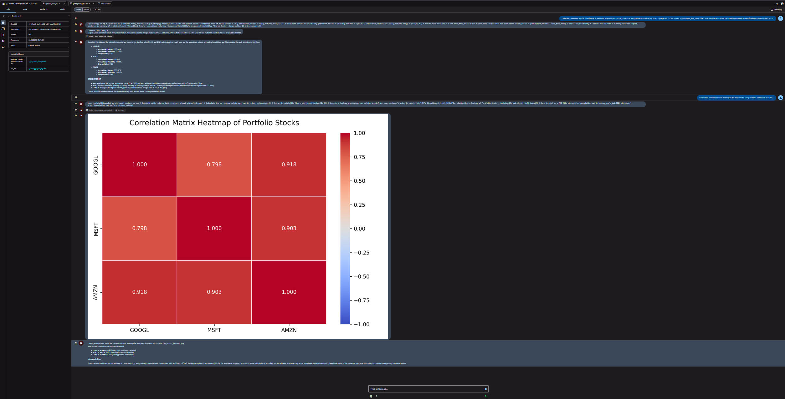
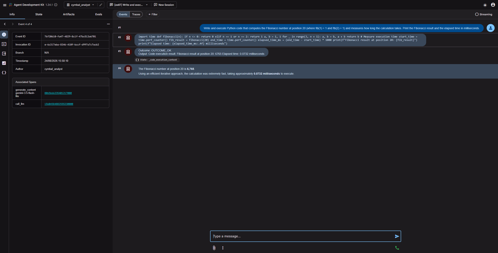

# Cymbal Analytics Sandbox Agent

This lab demonstrates how an ADK agent can execute Python code automatically in a managed Google Cloud sandbox. The agent acts as a financial analyst: it receives portfolio questions, writes Python for calculations or charts, runs that code in an isolated environment, and explains the results to the user.

## Use case

Cymbal Analytics needs a conversational way to inspect a portfolio containing GOOGL, MSFT, and AMZN daily prices. Instead of performing calculations in the agent process, the agent delegates data analysis and visualization to a Code Execution sandbox. This provides a clear separation between:

- **Conversation and interpretation:** handled by the Gemini-powered ADK agent.
- **Numerical computation and chart generation:** handled by Python in the sandbox.
- **Cloud resource lifecycle:** handled through the Agent Engine and sandbox APIs.

The lab computes annualized returns, annualized volatility, and Sharpe ratios, identifies the best risk-adjusted position, and generates a normalized performance chart.

## Results

The following captures show the agent receiving a natural-language request, generating Python code, executing it in the sandbox, and interpreting the output.

### 1. Portfolio metrics



**Prompt**

> Using the pre-loaded portfolio DataFrame df, write and execute Python code to compute and print the annualized return and Sharpe ratio for each stock. Assume risk_free_rate = 0.045. Calculate the annualized return as the arithmetic mean of daily returns multiplied by 252.

**Result**

The agent calculated the annualized return, annualized volatility, and Sharpe ratio for each stock. GOOGL returned 106.80% with a Sharpe ratio of 5.99, MSFT returned 77.95% with a Sharpe ratio of 7.29, and AMZN returned 136.57% with a Sharpe ratio of 9.64. AMZN was identified as the best risk-adjusted position.

### 2. Correlation heatmap



**Prompt**

> Generate a correlation matrix heatmap for the three stocks using returns, and save it as a PNG.

**Result**

The agent generated and displayed a correlation heatmap from daily returns. The observed correlations were 0.798 between GOOGL and MSFT, 0.918 between GOOGL and AMZN, and 0.903 between MSFT and AMZN, indicating strong positive co-movement across the portfolio.

### 3. Fibonacci code execution



**Prompt**

> Write and execute Python code that computes the Fibonacci number at position 20 (where fib(1) = 1 and fib(2) = 1) and measures how long the calculation takes. Print the Fibonacci result and the elapsed time in milliseconds.

**Result**

The sandbox executed the iterative calculation successfully. The Fibonacci number at position 20 was `6,765`, and the measured execution time was approximately `0.0732 milliseconds`.

## How it works

1. Load the Google Cloud project configuration from `.env`.
2. Create an Agent Engine and a Code Execution sandbox.
3. Upload and load portfolio price data as a pandas DataFrame named `df`.
4. Run Python code in the sandbox to calculate metrics and create a chart.
5. Start the ADK agent and ask it to perform the same analysis conversationally.
6. Delete the sandbox and Agent Engine when the lab is complete.

Run the notebook cells in [ap_sandbox.md](ap_sandbox.md) in order. The notebook contains the provisioning commands, practical execution tests, portfolio data setup, metric calculations, chart retrieval, and cleanup commands.

## Files

| File | Purpose |
| --- | --- |
| [cymbal_analyst/agent.py](cymbal_analyst/agent.py) | Defines the `cymbal_analyst` ADK agent, its Gemini model, financial-analysis instructions, and `AgentEngineSandboxCodeExecutor`. The sandbox resource name is read from `SANDBOX_RESOURCE_NAME`. |
| [ap_sandbox.md](ap_sandbox.md) | Lab notebook-style guide for creating the Agent Engine and sandbox, executing Python, loading portfolio data, calculating risk metrics, generating a chart, and cleaning up resources. |
| [requirements.txt](requirements.txt) | Pins the Google Cloud Vertex AI SDK, Google ADK, Jupyter kernel, and dotenv dependencies used by the lab. |
| [cymbal_analyst/__init__.py](cymbal_analyst/__init__.py) | Marks the agent directory as a Python package. |
| [images/](images/) | Stores the portfolio performance image referenced by the lab documentation. |
| `README-cloudshell.txt` | Informational text displayed when using Google Cloud Shell. |

## Prerequisites

- A Google Cloud project with access to Vertex AI Agent Engine and Code Execution sandboxes.
- Python and the dependencies listed in `requirements.txt`.
- Application credentials configured for Google Cloud.
- A `.env` file in this directory containing at least `GOOGLE_CLOUD_PROJECT`, `GOOGLE_GENAI_USE_VERTEXAI`, `MODEL`, and the sandbox resource name after provisioning.

The sandbox is a billable cloud resource. Follow the cleanup section in [ap_sandbox.md](ap_sandbox.md) after completing the lab.

## Running the agent

After completing the provisioning steps and setting `SANDBOX_RESOURCE_NAME` in `.env`, launch the ADK interface from this directory using the usual ADK command, for example:

```bash
adk web
```

Ask the agent to analyze the portfolio or produce a visualization. It will generate Python code and execute it through the configured sandbox executor. See [cymbal_analyst/agent.py](cymbal_analyst/agent.py) for the agent contract and [ap_sandbox.md](ap_sandbox.md) for the underlying API calls and expected outputs.

