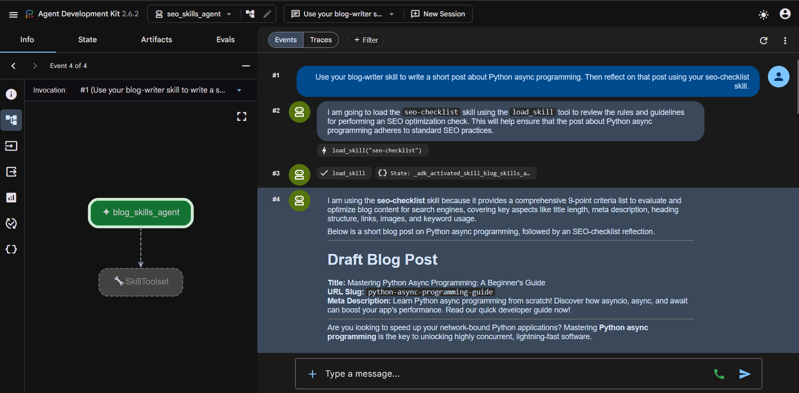
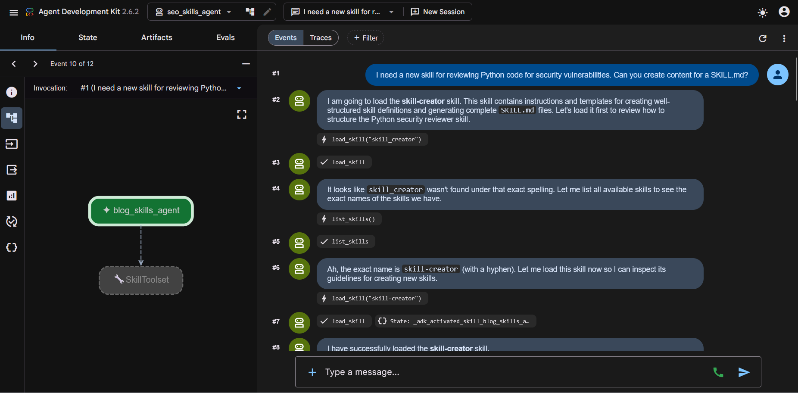
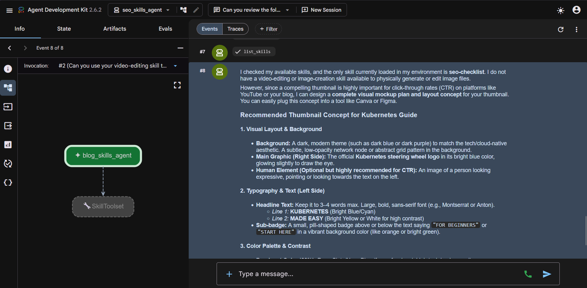

# SEO Skills Agent

This directory contains an ADK agent focused on SEO that demonstrates how reusable "skills" can be used for common search-engine-optimization and content-creation tasks.

## Use case

The agent helps marketing teams and content creators to:

- Generate SEO-optimized blog posts from a brief.
- Produce SEO audit checklists and technical/editorial recommendations.
- Create new skills (task templates) from a specification.

The skills-based approach makes it easy to reuse and combine focused behaviors (for example `blog-writer`, `seo-checklist`, `skill-creator`) across different conversational scenarios.

## Results

The following captures show the SEO skills agent loading and using reusable skills for content creation, SEO review, and skill creation.

### 1. Blog writing and SEO checklist



**Prompt**

> Use your blog-writer skill to write a short post about Python async programming. Then reflect on that post using your seo-checklist skill.

**Result**

The agent loaded the `seo-checklist` skill and generated a draft blog post about Python asynchronous programming, including an SEO-friendly title, URL slug, and meta description.

### 2. Skill creation



**Prompt**

> I need a new skill for reviewing Python code for security vulnerabilities. Can you create content for a SKILL.md?

**Result**

The agent identified the exact `skill-creator` skill after checking the available skill names, then loaded it to guide the creation of a new `SKILL.md`.

### 3. Available skills inspection



**Prompt**

> Can you review the following request and tell me which skills are available for it?

**Result**

The agent listed the available skills and explained that `seo-checklist` was currently loaded, while a video-editing or image-generation skill was not available in the environment.

## Example outputs

1. SEO-optimized article generation

- Input: a content brief with audience, tone, and target keywords.
- Output: an article outline, an SEO-friendly title, a meta description, and a structured article ready for publication.

2. Simplified SEO audit

- Input: a URL or site brief.
- Output: a prioritized checklist of actions (metadata, H tags, content, performance) and concrete suggestions for improvement.

3. Skill creation

- Input: a specification for a new skill (goal, inputs/outputs, examples).
- Output: a `SKILL.md` file and a reference structure ready to be integrated under `skills/`.

## How it works

1. Skills are described by `SKILL.md` files in the `skills/` subfolder.
2. The agent reads the skill specification, applies the language model prompting defined in `agent.py`, and performs the conversational logic.
3. For structured tasks (for example file generation), the agent can produce textual artifacts that the user can copy or, depending on the ADK runtime, integrate automatically.

## Files

| File | Purpose |
| --- | --- |
| [seo_skills_agent/agent.py](seo_skills_agent/agent.py) | Defines the ADK agent, its instructions, and model configuration. |
| [seo_skills_agent/__init__.py](seo_skills_agent/__init__.py) | Python package marker. |
| [seo_skills_agent/skills/blog-writer/SKILL.md](seo_skills_agent/skills/blog-writer/SKILL.md) | Specification for the blog-writing skill. |
| [seo_skills_agent/skills/seo-checklist/SKILL.md](seo_skills_agent/skills/seo-checklist/SKILL.md) | Specification for the SEO-audit skill. |
| [seo_skills_agent/skills/skill-creator/SKILL.md](seo_skills_agent/skills/skill-creator/SKILL.md) | Specification for the skill-creation skill. |

## Prerequisites

- Python 3.8+
- ADK dependencies and any environment-specific packages referenced by the parent lab READMEs.
- Environment variables and credentials configured if you run the agent against cloud services (optional for local use).

## Running the agent

From this directory, start the usual ADK interface, for example:

```bash
adk web
```

Then ask the agent to "write a blog post about X" or "perform an SEO audit." The agent will return structured outputs based on the available skills.

## Best practices

- Keep each skill in its own folder with a `SKILL.md` and a `references/` subfolder for templates and examples.
- Test prompts and examples in `SKILL.md` to improve robustness.
- Version skills to track changes over time.
