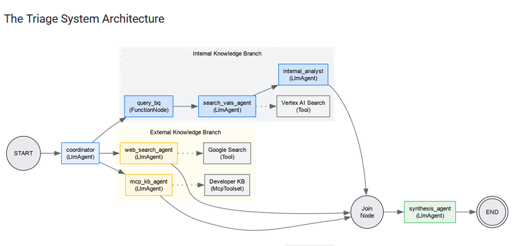

# DevSecOps Support Agent

> **Deployment notice:** This agent was designed for deployment on **Gemini Enterprise Platform**. It cannot be run locally without adapting its configuration, infrastructure integrations, and credentials.

This multi-agent system, built with the Google Agent Development Kit (ADK), helps analyze and resolve technical incidents.

It first refines the incident report, then cross-references internal knowledge and public sources before proposing a documented resolution.

## Architecture

The coordinator extracts useful incident details and launches these searches in parallel:

- similar incidents stored in BigQuery;
- internal documentation indexed with Vertex AI Search;
- a developer knowledge base exposed through MCP;
- public resources using Google Search.

The results are merged and analyzed by a synthesis agent. Internal sources take priority; external sources are used only when no internal reference exists or when they are explicitly needed as a complement.

## Deployment Requirements

- Python and the dependencies in `requirements.txt`;
- a configured Google Cloud project;
- a `.env` file defining, among others, `MODEL`, `GOOGLE_CLOUD_PROJECT`, `GOOGLE_CLOUD_LOCATION`, `MCP_SERVER_NAME`, and data-source identifiers;
- Gemini Enterprise Platform resources matching the configured BigQuery, Vertex AI Search, MCP, and Agent Registry integrations.

The agent protects external tool calls by blocking requests containing terms associated with sensitive secrets or credentials.

This example comes from the [Build and Deploy Multi-Agent ADK Systems to Gemini Enterprise lab](https://partner.skills.google/paths/4144/course_templates/1752/labs/633117).

The ADK application exposes the workflow as `support_agent`.